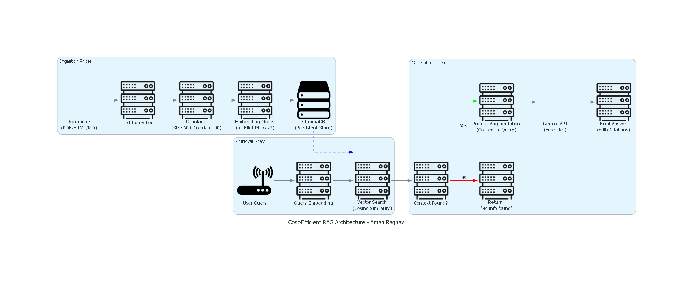

Cost-Efficient RAG Application

This project is developed as part of the Gen AI take-home assignment. The objective of this project is to build a Retrieval-Augmented Generation (RAG) system using a low-cost vector database instead of a managed vector database.

The application accepts PDF, Markdown, and HTML documents, converts them into text chunks, generates embeddings using the all-MiniLM-L6-v2 model, and stores the vectors in ChromaDB. Users can ask questions through an API endpoint, and the system retrieves the most relevant chunks before generating an answer using the Gemini API.

The project includes configurable chunk size and overlap, duplicate document handling, metadata storage, top-k retrieval, chunk citations, query logging, latency measurement, and token usage tracking. If relevant information is not found, the system returns a response indicating that no relevant context is available.

FastAPI is used for building the API, ChromaDB is used for vector storage, Sentence Transformers are used for embeddings, and Gemini is used for answer generation.

The project also includes retrieval evaluation metrics such as Recall@k, Hit Rate, MRR, and nDCG, along with answer evaluation using faithfulness and answer relevance scores. A cost comparison between ChromaDB and managed vector databases is also provided.

## System Architecture

To run the project:

first you create virtual environment
01. uv venv cost_efficient_env

02. uv pip install -r requirements.txt

03. create api key for gemini or openai than put in .env file than run

04. uvicorn main:app --reload

This project was developed to evaluate the feasibility of using a local vector database for building a cost-efficient RAG application.